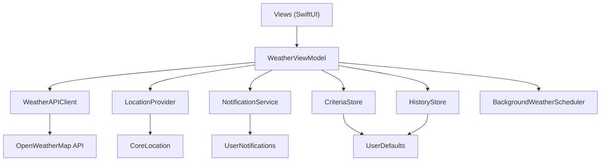

# WeatherWise Architecture

This document explains how WeatherWise is structured for maintainability, testing,
and background operation. It is intended for graders and future contributors.

## Goals

WeatherWise watches local weather and notifies the user when conditions match
their ideal outdoor criteria. The implementation prioritizes:

1. Clear separation of UI, state, and I/O (MVVM + services)
2. Protocol-based dependencies so unit tests can inject fakes
3. Persistence for user settings and evaluation history
4. Best-effort background refresh via `BGTaskScheduler`

## Layer overview

### `App/`

- `WeatherWiseApp` creates the `WeatherViewModel`, injects it into the environment,
  and starts monitoring.
- `AppDelegate` registers the background app-refresh handler and forwards work to
  the shared view model when iOS wakes the app.

### `Models/`

- `WeatherModel` — domain weather reading; `meets(_:)` evaluates criteria.
- `WeatherCriteria` — user-editable thresholds, check interval, and quiet hours.
  Evaluation logic is centralized in `isSatisfied(temperature:humidity:windSpeed:)`
  and shared by current conditions and forecast slots. Decoding tolerates
  criteria saved by older versions (missing quiet-hour keys fall back to defaults).
- `ForecastSlot` / `GoodWeatherWindow` — 3-hour forecast slots mapped from the
  OpenWeatherMap forecast endpoint, plus the computation of the next contiguous
  stretch of slots matching the user's criteria.
- `WeatherCheckRecord` — one persisted evaluation for history.
- `OpenWeatherResponse` / `ForecastResponse` — DTOs matching the OpenWeatherMap
  JSON payloads.

### `Services/`

- Protocols in `ServiceProtocols.swift`: `WeatherFetching`, `Locating`,
  `Notifying`, `CriteriaPersisting`, `HistoryPersisting`.
- Concrete types: `WeatherAPIClient`, `LocationProvider`, `NotificationService`,
  `CriteriaStore`, `HistoryStore`, `BackgroundWeatherScheduler`, `SecretsLoader`.
- `DirectionsBuilder` — pure URL construction for Apple Maps / Google Maps
  directions (native deep link + web fallback). Free of UIKit so it is
  unit-testable; URL opening lives in the `DirectionsMenu` view.

### `ViewModels/`

- `WeatherViewModel` owns published UI state, orchestration, timers, history
  updates, and notification decisions. Views do not call networking directly.

### `DesignSystem/`

The reusable UI library for current and future screens:

- `WWGlass.swift` — the Liquid Glass component layer. `wwGlassCard`,
  `wwGlassCapsule`, `wwGlassCircle`, `wwGlassButton`, `WWGlassContainer`, and
  `wwGlassID` wrap Apple's iOS 26 `glassEffect` APIs. Every component carries
  a translucent-material fallback for earlier iOS versions, and all iOS 26
  API references are wrapped in `#if compiler(>=6.2)` so the project still
  compiles with pre-iOS-26 SDKs (e.g. Xcode 16 on CI).
- `SkyBackground.swift` — condition-aware animated gradient behind every
  screen; deliberately rich so glass surfaces have content to refract.

Guidelines: use `.interactive()` glass only on surfaces the user touches
(chips, buttons), wrap sibling glass elements in one `WWGlassContainer` so
they share a single backdrop sample, and pass semantic tints from
`WWGlassTint` rather than raw colors.

### `Views/`

- `ContentView` — status routing (permission / error / weather) over the sky
  background, all states rendered on glass cards.
- `WeatherDisplay` — hero glass card, metric chips, countdown.
- `ForecastSection` — good-weather-window banner + forecast chip strip.
- `SettingsView` — edit and save criteria (glass-backed form).
- `HistoryView` — past evaluations as glass rows.

## Data flow (foreground check)

1. User grants location + notification permission.
2. View model requests a coordinate from `LocationProvider`.
3. `WeatherAPIClient` fetches current conditions and the 3-hour forecast
   (imperial units) from OpenWeatherMap.
4. Responses map to `WeatherModel` and `[ForecastSlot]`.
5. The current reading is evaluated with the user's `WeatherCriteria`; the
   forecast is scanned for the next `GoodWeatherWindow`.
6. A `WeatherCheckRecord` is prepended to history (capped at 50).
7. If criteria match (not the first launch check, and not during quiet hours),
   a local notification is sent.
8. A background refresh is scheduled for approximately the configured interval.

A forecast failure is deliberately non-fatal: current conditions still render
and only the forecast section is omitted.

## Secrets

The OpenWeatherMap API key is loaded from `Secrets.plist` (gitignored).
`Secrets.example.plist` is committed as a template. Missing keys produce a clear
configuration error instead of a cryptic network failure.

## Background refresh limitations

iOS decides when `BGAppRefreshTask` runs. The `earliestBeginDate` is a hint, not
a guarantee. WeatherWise also uses a foreground `Timer` while the app is active.
True always-on monitoring would require additional entitlements and careful
battery tradeoffs; those are documented as future work rather than oversold.

## Testing strategy

Unit tests live in `WeatherWiseTests` and cover:

- Criteria defaults and normalization
- Boundary evaluation of `meets(_:)`
- JSON decoding of OpenWeatherMap fixtures
- Persistence round-trips for criteria and history
- View model behavior with mocked location/weather/notification dependencies

Run tests in Xcode with **Product → Test** (⌘U).

## Why this design

| Decision | Rationale |
|----------|-----------|
| Protocols for I/O | Enables deterministic unit tests without hitting the network or GPS |
| Criteria as a model | Makes README “customizable criteria” real and keeps evaluation pure |
| History store | Provides demoable evidence of monitoring over time |
| ViewModel as façade | Keeps SwiftUI views thin and matches the stated MVVM approach |
