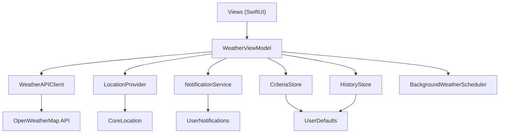

# WeatherWise Architecture

This document explains how WeatherWise is structured for maintainability, testing,
and background operation. It is intended for graders and future contributors.

## Goals

WeatherWise watches local weather and notifies the user when conditions match
their ideal outdoor criteria. The implementation prioritizes:

1. Clear separation of UI, state, and I/O (MVVM + services)
2. Protocol-based dependencies so unit tests can inject fakes
3. Persistence for user settings and evaluation history
4. Best-effort background refresh via `BGTaskScheduler`

## Layer overview

### `App/`

- `WeatherWiseApp` creates the `WeatherViewModel`, injects it into the environment,
  and starts monitoring.
- `AppDelegate` registers the background app-refresh handler and forwards work to
  the shared view model when iOS wakes the app.

### `Models/`

- `WeatherModel` — domain weather reading; `meets(_:)` evaluates criteria.
- `WeatherCriteria` — user-editable thresholds + check interval.
- `WeatherCheckRecord` — one persisted evaluation for history.
- `OpenWeatherResponse` — DTO matching the OpenWeatherMap JSON payload.

### `Services/`

- Protocols in `ServiceProtocols.swift`: `WeatherFetching`, `Locating`,
  `Notifying`, `CriteriaPersisting`, `HistoryPersisting`.
- Concrete types: `WeatherAPIClient`, `LocationProvider`, `NotificationService`,
  `CriteriaStore`, `HistoryStore`, `BackgroundWeatherScheduler`, `SecretsLoader`.

### `ViewModels/`

- `WeatherViewModel` owns published UI state, orchestration, timers, history
  updates, and notification decisions. Views do not call networking directly.

### `Views/`

- `ContentView` — status routing (permission / error / weather).
- `WeatherDisplay` — current conditions + countdown.
- `SettingsView` — edit and save criteria.
- `HistoryView` — past evaluations.

## Data flow (foreground check)

1. User grants location + notification permission.
2. View model requests a coordinate from `LocationProvider`.
3. `WeatherAPIClient` fetches imperial units from OpenWeatherMap.
4. Response maps to `WeatherModel`.
5. Model is evaluated with the current `WeatherCriteria`.
6. A `WeatherCheckRecord` is prepended to history (capped at 50).
7. If criteria match (and this is not the first launch check), a local
   notification is sent.
8. A background refresh is scheduled for approximately the configured interval.

## Secrets

The OpenWeatherMap API key is loaded from `Secrets.plist` (gitignored).
`Secrets.example.plist` is committed as a template. Missing keys produce a clear
configuration error instead of a cryptic network failure.

## Background refresh limitations

iOS decides when `BGAppRefreshTask` runs. The `earliestBeginDate` is a hint, not
a guarantee. WeatherWise also uses a foreground `Timer` while the app is active.
True always-on monitoring would require additional entitlements and careful
battery tradeoffs; those are documented as future work rather than oversold.

## Testing strategy

Unit tests live in `WeatherWiseTests` and cover:

- Criteria defaults and normalization
- Boundary evaluation of `meets(_:)`
- JSON decoding of OpenWeatherMap fixtures
- Persistence round-trips for criteria and history
- View model behavior with mocked location/weather/notification dependencies

Run tests in Xcode with **Product → Test** (⌘U).

## Why this design

| Decision | Rationale |
|----------|-----------|
| Protocols for I/O | Enables deterministic unit tests without hitting the network or GPS |
| Criteria as a model | Makes README “customizable criteria” real and keeps evaluation pure |
| History store | Provides demoable evidence of monitoring over time |
| ViewModel as façade | Keeps SwiftUI views thin and matches the stated MVVM approach |
